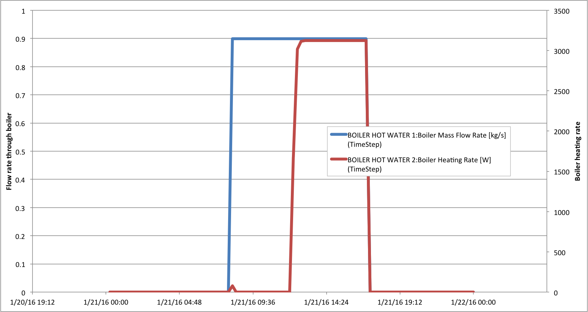

***************
Testing Results
***************

Each test will be described here with the current issues, and updated as I make changes.

Test 1
------

Test 1 looks good.

Other tests
-----------

Here.

Test 18
-------

Test 18 is having the following issues:

* The variable speed branch pump for boiler 2 does not turn off during the morning hours when the boiler doesn't need any flow.  Boiler 2 requests flow for one time step as it rejects the pickup load, but then the boiler stops adding heat yet the pump stays on.

See:

